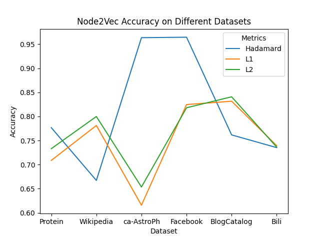
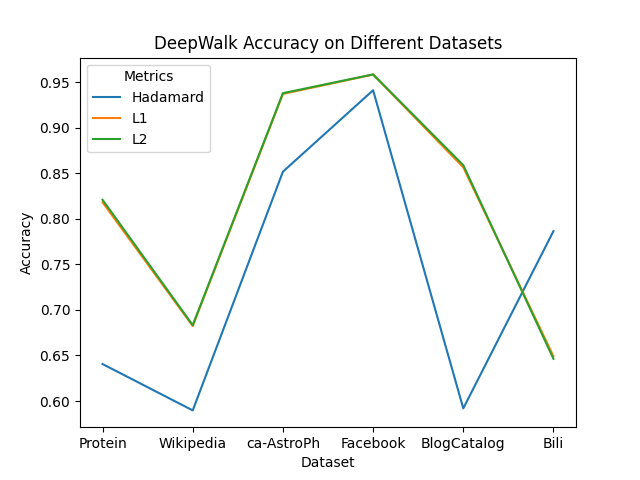
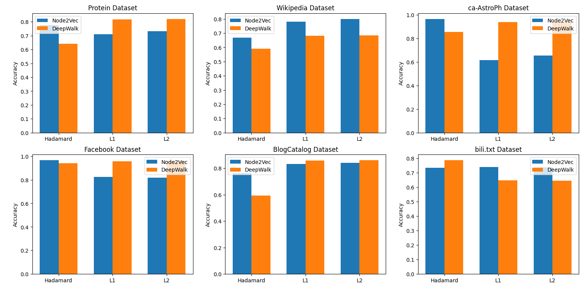

# 实验对比Node2Vec和DeepWalk

## 实验目的

在图的连接预测任务中进行Node2Vec和DeepWalk的性能对比

## 实验原理

分别采用Node2Vec和DeepWalk两种算法进行节点的图嵌入，之后分别采用Hadamard/L1范数/L2范数计算连接的嵌入，并作为每条边的特征向量。
采用逻辑回归模型，根据边的特征向量，训练模型并预测该条边是否存在。
以预测的正确率作为评价结果，正确率取10次实验的平均值。


## 数据集
1. 博主社交网络（BlogCatalog）
  - 标签：博主兴趣方向
  - 10312个节点，333983条边，39个不同的标签
2. 智人蛋白质网络（Protein-Protein Interactions(PPI)）
  - 标签：“基因组和生物状态”
  - 3890个节点，76584条边，50个不同的标签
3. Wikipedia
  - 标签是“词注标记”
  - 4777个节点，184812条边，40个不同的标签
4. Ca-AstroPh
5. Facebook
6. bili_tag

## 实验过程
以bili_tag数据集为例：


### import

```python
import networkx as nx
from node2vec import Node2Vec
import matplotlib.pyplot as plt
import numpy as np

import csv
import math 
import random
from node2vec.edges import HadamardEmbedder
import sklearn
import os
import gensim
import numpy as np
import pandas as pd
import matplotlib.pyplot as plt
import matplotlib.gridspec as gridspec
from sklearn.preprocessing import LabelEncoder
from sklearn.linear_model import LogisticRegression
```

    

### 定义函数和变量

#### 定义嵌入函数


```python
edge_functions = {
    "hadamard": lambda a, b: a * b,
    "average": lambda a, b: 0.5 * (a + b),
    "L1": lambda a, b: np.abs(a - b),
    "L2": lambda a, b: np.abs(a - b) ** 2,
}
```


#### 从正训练集中生成测试集，并生成用于训练和测试的负样本


```python
def create_test_and_training_set(positive_training_set, percentage, negative_percentage, min_degree):
    positive_test_set = nx.Graph()
    # 将正训练集中的节点添加到原本为空测试图中
    positive_test_set.add_nodes_from(positive_training_set)

    # 生成用于训练的负样本：从正训练集中获取所有不存在的边（负样本）的列表all_negative_samples。然后，创建一个布尔数组acceptable，用于跟踪哪些负样本是可接受的
    all_negative_samples = list(nx.non_edges(positive_training_set))
    accetable = [True for i in range(len(all_negative_samples))]

    node_number = positive_training_set.number_of_nodes()
    node_list = positive_training_set.nodes()

    # 将正训练集中的一部分边移动到测试集中
    for node in node_list:

        percent = int(round((percentage * len(positive_training_set.edges(node)))))
        edges = list(positive_training_set.edges(node))
        counter = 0
        edge_count = len(edges)

        for attempt in range(edge_count):

            if len(edges) > 0:
                u, v = edges.pop(random.randrange(len(edges)))

                if counter < percent:
                    if (positive_training_set.degree[u] > min_degree and positive_training_set.degree[v] > min_degree):
                        positive_test_set.add_edge(u, v)
                        positive_training_set.remove_edge(u, v)
                        counter += 1

                else:
                    break

            else:
                break

    # 生成用于训练的负样本
    negative_edges_for_training = []

    for i in range(int((2 * negative_percentage) * len(positive_training_set.edges()))):
        index = random.randint(0, len(all_negative_samples))
        negative_edges_for_training.append(all_negative_samples[index])
        accetable[index] = False

    negative_training_set = nx.Graph()
    negative_training_set.add_nodes_from(positive_training_set)
    negative_training_set.add_edges_from(negative_edges_for_training)
    
    # 从 all_negative_samples 中随机选择一定数量的负样本，并将它们添加到负测试集
    negative_edges_for_test = []

    i = 0
    # 循环直到：生成的负样本数量超过预设的负样本比例*正训练集中边的数量的两倍
    while i < (int((2 * negative_percentage) * len(positive_training_set.edges()))):

        index = random.randint(0, len(all_negative_samples))

        # 如果为True（表示未被选择过），则将该负样本添加到负测试集中，并设置为 False
        if accetable[index]:
            negative_edges_for_test.append(all_negative_samples[index])
            accetable[index] = False
            i += 1

    negative_test_set = nx.Graph()
    negative_test_set.add_nodes_from(positive_training_set)
    negative_test_set.add_edges_from(negative_edges_for_test)

    return positive_test_set, positive_training_set, negative_test_set, negative_training_set
```

####  为每条边生成标签，正样本为1，负样本为0


```python
def get_edges_and_labels(positive, negative):
    edges = list(positive) + list(negative)
    labels = np.zeros(len(edges))
    labels[:len(positive)] = 1
    return edges, labels
```

#### 从正样本和负样本中获取边和标签


```python
def edges_to_features(model, edge_list, edge_function, dimensions): # d=128????   32!!!!!
    
    n_tot = len(edge_list)
    features_vec = np.empty((n_tot, dimensions), dtype='f')
    # print(model.wv.key_to_index)
    global mode
    for ii in range(n_tot):
        v1, v2 = edge_list[ii]
        
        
        if mode != "deepwalk":
            
            emb1 = np.asarray(model.wv[str(v1)])  
            emb2 = np.asarray(model.wv[str(v2)])  
        else:
            emb1 = np.asarray(model.wv[v1])  
            emb2 = np.asarray(model.wv[v2])  

        features_vec[ii] = edge_function(emb1, emb2)  # Calculate edge feature

    return features_vec
```

#### 训练/测试/评分


```python
def training_and_testing(filename, mode):
    # 读取图数据并创建训练集和测试集
    graph = nx.Graph()
    G = nx.read_edgelist(filename, create_using=graph, nodetype=int, data=(('weight', int),))
    print('OK - Graph created')  # debug

    min_degree = 2

    print('Creating training and test set...')  # debug
    positive_test_set, positive_training_set, negative_test_set, negative_training_set = create_test_and_training_set(G,
                                                                                                                      0.2,
                                                                                                                      0.5,
                                                                                                                      min_degree)
    edges, training_labels = get_edges_and_labels(positive_training_set.edges(), negative_training_set.edges())
    print('OK - Training and test set created')  # debug

    # 选定实验参数
    dims = 32 # 嵌入向量的维度
    walk_length = 5 # 随机游走序列最大长度
    gamma = 10 # 每个节点作为起始点生成随机游走序列个数

    # 使用node2vec或deepwalk模型进行节点嵌入和边嵌入
    if mode == "deepwalk":
        def get_randomwalk(node, path_length):
            '''
            输入起始节点和路径长度，生成随机游走节点序列
            '''

            random_walk = [node]

            for i in range(path_length-1):
                # 汇总邻接节点
                temp = list(G.neighbors(node))
                temp = list(set(temp) - set(random_walk))    
                if len(temp) == 0:
                    break
                # 从邻接节点中随机选择下一个节点
                random_node = random.choice(temp)
                random_walk.append(random_node)
                node = random_node

            return random_walk
                
        
        
        
        all_nodes = list(G.nodes())
        
        random_walks = []
        from tqdm import tqdm
        for n in tqdm(all_nodes): # 遍历每个节点
            for i in range(gamma): # 每个节点作为起始点生成gamma个随机游走序列
                random_walks.append(get_randomwalk(n, walk_length))
        
        from gensim.models import Word2Vec
        model = Word2Vec(vector_size=32, # Embedding维数
                 window=1, # 窗口宽度
                 sg=1, # Skip-Gram
                 hs=0, # 不加分层softmax
                 negative=10, # 负采样
                 alpha=0.03,  # 初始学习率
                 min_alpha=0.0007, # 最小学习率
                 seed=14 # 随机数种子
                )
        # 用随机游走序列构建词汇表
        model.build_vocab(random_walks, progress_per=2)
        model.train(random_walks, total_examples=model.corpus_count, epochs=50, report_delay=1)

    else:  # Node2Vec mode
        print('Node2Vec...')  # debug
        node2vec = Node2Vec(positive_training_set, dimensions=dims, walk_length=walk_length, num_walks=gamma, workers=4)
        model = node2vec.fit(window=10, min_count=1, batch_words=4)

    print('OK - Model created')  # debug

    # 边嵌入
    print('Edge embedding...')  # debug
    X_Hadamard = edges_to_features(model, edges, edge_functions['hadamard'], dims)
    X_L1 = edges_to_features(model, edges, edge_functions['L1'], dims)
    X_L2 = edges_to_features(model, edges, edge_functions['L2'], dims)
    print('OK - Embedding done')  # debug

    # LOGISTIC REGRESSION

    print('Logistic regression - Computing scores...')  # debug

    # 采用逻辑回归模型训练
    clf_Hadamard = LogisticRegression()
    clf_L1 = LogisticRegression()
    clf_L2 = LogisticRegression()

    clf_Hadamard.fit(X_Hadamard, training_labels)
    clf_L1.fit(X_L1, training_labels)
    clf_L2.fit(X_L2, training_labels)

    # TESTING - Prediction

    # 将正测试集的边转换为列表形式存储在test_edges中
    test_edges = list(positive_test_set.edges())

    positive_emb_test_Hadamard = edges_to_features(model, test_edges, edge_functions['hadamard'], dims)
    positive_emb_test_L1 = edges_to_features(model, test_edges, edge_functions['L1'], dims)
    positive_emb_test_L2 = edges_to_features(model, test_edges, edge_functions['L2'], dims)

    # Embedding -- Negative test set
    test_edges = list(negative_test_set.edges())

    negative_emb_test_Hadamard = edges_to_features(model, test_edges, edge_functions['hadamard'], dims)
    negative_emb_test_L1 = edges_to_features(model, test_edges, edge_functions['L1'], dims)
    negative_emb_test_L2 = edges_to_features(model, test_edges, edge_functions['L2'], dims)

    # Prepare whole test set for every embedding function
    Hadamard_edges, y_test_Hadamard = get_edges_and_labels(positive_emb_test_Hadamard, negative_emb_test_Hadamard)
    L1_edges, y_test_L1 = get_edges_and_labels(positive_emb_test_L1, negative_emb_test_L1)
    L2_edges, y_test_L2 = get_edges_and_labels(positive_emb_test_L2, negative_emb_test_L2)

    # 使用训练好的逻辑回归分类器分别对嵌入函数得到的特征向量进行预测
    print('Testing...')  # debug
    y_pred_test_Hadamard = clf_Hadamard.predict(Hadamard_edges)
    y_pred_test_L1 = clf_L1.predict(L1_edges)
    y_pred_test_L2 = clf_L2.predict(L2_edges)

    # 计算准确率评分
    score_Hadamard = sklearn.metrics.accuracy_score(y_test_Hadamard, y_pred_test_Hadamard)
    score_L1 = sklearn.metrics.accuracy_score(y_test_L1, y_pred_test_L1)
    score_L2 = sklearn.metrics.accuracy_score(y_test_L2, y_pred_test_L2)

    return score_Hadamard, score_L1, score_L2
```

### 开始性能测试

#### 获取数据集并处理格式
```python
# DATASET
filename = 'bili_tag.txt'  # ------------------------------------------------
if not (os.path.isfile(filename)):
    print('Error: Dataset does not exist')
    exit()

import chardet


with open('/datasets/' + filename, 'rb') as file:
    raw_data = file.read()
    result = chardet.detect(raw_data)
    encoding = result['encoding']


word_to_int = {}
current_int = 0

with open('/datasets/' +filename, 'r', encoding=encoding) as file:
    lines = file.readlines()

output_lines = []

for line in lines:
    words = line.strip().split('\t')
    output_words = []
    for word in words:
        if word not in word_to_int:
            word_to_int[word] = current_int
            current_int += 1
        output_words.append(str(word_to_int[word]))
    output_lines.append('\t'.join(output_words))

output_text = '\n'.join(output_lines)

# 将替换后的内容写入新的txt文件
with open('/datasets/' + 'processed_' + filename, 'w') as file:
    file.write(output_text)

#更新文件名
filename = '/datasets/' + 'processed_' + filename

# 输出词语到整数的映射关系
# for word, integer in word_to_int.items():
#     print(f'{word}: {integer}')


```


```python
# 设置实验重复的次数
runs = 10

```

#### 使用Node2Vec对数据集进行训练和测试，并生成评分


```python
mode = 'Node2Vec'
Hadamard_sum = L1_sum = L2_sum = 0

for i in range(runs):
    print('##############################\n ')
    print('Starting iteration ' + str(i + 1))  # Logging
    score_Hadamard, score_L1, score_L2 = training_and_testing(filename, mode)
    Hadamard_sum += score_Hadamard
    L1_sum += score_L1
    L2_sum += score_L2
    print('Iteration ' + str(i + 1) + ' finished\n')  # Logging
```

    ##############################
     
    Starting iteration 1
    OK - Graph created
    Creating training and test set...
    OK - Training and test set created
    Node2Vec...
    


    Computing transition probabilities:   0%|          | 0/559 [00:00<?, ?it/s]


    OK - Model created
    Edge embedding...
    OK - Embedding done
    Logistic regression - Computing scores...
    Testing...
    Iteration 1 finished
    
    ##############################
     
    Starting iteration 2
    
    后略
    
    


```python
Hadamard_avg_score = Hadamard_sum / (float(runs))
L1_avg_score = L1_sum / (float(runs))
L2_avg_score = L2_sum / (float(runs))
```

#### 输出评分结果


```python
print("Node2Vec -> accuracy for " + str(runs) + " executions on " + filename + " dataset:")
print("Hadamard:" + str(Hadamard_avg_score) + "\n\r" + "L1: " + str(L1_avg_score) + "\n\r" + "L2: " + str(L2_avg_score) )
```

    Node2Vec -> accuracy for 10 executions on bili.txt dataset:
    Hadamard:0.7387660069848662
    L1: 0.7419091967403958
    L2: 0.740512223515716
    

#### 使用deepwalk进行相同的实验


```python
mode = "deepwalk"
Hadamard_sum = L1_sum = L2_sum = 0
for i in range(runs):
    print('##############################\n ')
    print('Starting iteration ' + str(i + 1))  # Logging
    score_Hadamard, score_L1, score_L2 = training_and_testing(filename, mode)
    Hadamard_sum += score_Hadamard
    L1_sum += score_L1
    L2_sum += score_L2
    print('Iteration ' + str(i + 1) + ' finished\n')  # Logging
```

    ##############################
     
    Starting iteration 1
    OK - Graph created
    Creating training and test set...
    OK - Training and test set created
    

    100%|██████████████████████████████████████████████████████████████████████████████| 559/559 [00:00<00:00, 2583.45it/s]
    

    OK - Model created
    Edge embedding...
    OK - Embedding done
    Logistic regression - Computing scores...
    Testing...
    Iteration 1 finished
    
    ##############################
     
    Starting iteration 2
    
   后略

    Iteration 10 finished
    
    
#### 输出评分结果

```python
Hadamard_avg_score_d = Hadamard_sum / (float(runs))
L1_avg_score_d = L1_sum / (float(runs))
L2_avg_score_d = L2_sum / (float(runs))
```


```python
print("DeepWalk -> accuracy for " + str(runs) + " executions on " + filename + " dataset:")
print("Hadamard:" + str(Hadamard_avg_score_d) + "\n\r" + "L1: " + str(L1_avg_score_d) + "\n\r" + "L2: " + str(L2_avg_score_d) )
```

    DeepWalk -> accuracy for 10 executions on bili.txt dataset:
    Hadamard:0.7888242142025611
    L1: 0.659604190919674
    L2: 0.6534342258440046
    

## 实验结论

### 准确率

|           |Node2Vec-H |Node2Vec-L1|Node2Vec-L2| DeepWalk-H| DeepWalk-L1|DeepWalk-L2|
|:---------:|:---------:|:---------:|:---------:|:---------:|:---------:|:------------:|
| protein   |   0.7768  | 0.7088    | 0.7331    |   0.6406  |  0.8181    | 0.8209  |
| wikipedia |   0.6672  | 0.7812    | 0.7999    |   0.58    |  0.6823    | 0.6833  |
|ca-AstroPh |   0.9635  | 0.6158    | 0.6536    |   0.851   |  0.9371    | 0.9379  |
| facebook  |   0.9645  | 0.8247    | 0.8180    |   0.941   |  0.9583    | 0.9585  |
|blogcatalog|   0.7617  | 0.8316    | 0.8408    |   0.591   |  0.8565    | 0.8589  |
| bili_tag  |   0.7353  | 0.7393    | 0.7363    |   0.786   |  0.6491    | 0.6463  |


   - 在protein数据集上，Node2Vec的准确率（Hadamard: 0.7768，L1: 0.7088，L2: 0.7331）均优于DeepWalk的准确率（Hadamard: 0.6406，L1: 0.8181，L2: 0.8209）。
   - 在wikipedia数据集上，Node2Vec的准确率（Hadamard: 0.6672，L1: 0.7812，L2: 0.7999）相对于DeepWalk的准确率（Hadamard: 0.5897，L1: 0.6823，L2: 0.6833）更高。
   - 在ca-AstroPh数据集上，Node2Vec的准确率（Hadamard: 0.9635，L1: 0.6158，L2: 0.6536）相对于DeepWalk的准确率（Hadamard: 0.8517，L1: 0.9371，L2: 0.9380）更高。
   - 在facebook数据集上，Node2Vec的准确率（Hadamard: 0.9645，L1: 0.8247，L2: 0.8180）相对于DeepWalk的准确率（Hadamard: 0.9411，L1: 0.9583，L2: 0.9585）稍高。
   - 在blogcatalog数据集上，Node2Vec的准确率（Hadamard: 0.7618，L1: 0.8316，L2: 0.8409）相对于DeepWalk的准确率（Hadamard: 0.5919，L1: 0.8565，L2: 0.8589）更高。
   - 在bili_tag数据集上，Node2Vec的准确率（Hadamard: 0.7388，L1: 0.7419，L2: 0.7405）相对于DeepWalk的准确率（Hadamard: 0.7888，L1: 0.6596，L2: 0.6534）更高。

### 实验结果直观表示
   - Node2Vec:
   

   - DeepWalk:
   

   - Node2Vec与DeepWalk性能对比：
   

### 综合对比

在以上多个数据集上，Node2Vec的准确率普遍优于DeepWalk的准确率，尤其在protein和wikipedia数据集上表现突出。

由此可以得出结论，在连接预测任务中，Node2Vec相对于DeepWalk具有更好的性能和表现
